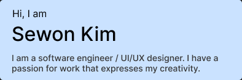

## About Me

I find great passion in the rewards and challenges of full-stack development, application development, and making machine learning models. 🚀 From crafting picture-perfect UIs to optimizing back-end logic, I am a developer who finds joy in making ideas come to life. 💡 I love diving deep into code, exploring new technologies, and making practical applications that could have a positive impact on the world. Let's build something amazing together!

## My Projects

* [QuickNotes3](https://sewonkim0.github.io/Quicknotes3-Website/): A highly practical and intuitive notetaking application, created to enhance the user's academic performance. An application developed with C# windows forms.

## My Hobbies

Coming from a rich experience in musical performance, I like to play the clarinet, oboe, and piano. I have also engaged in musical composition and am working to create musical albums that people could enjoy.

## Connect With Me!

* [LinkedIn](https://www.linkedin.com/in/sewon-kim-b0285423b/)
* [Portfolio](https://sewonkim0.github.io/new-portfolio/)
* [Youtube](https://www.youtube.com/channel/UCOkuvvVxC3kBF26IcPeJk9g)
